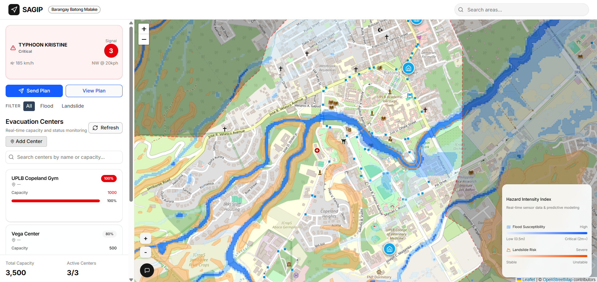
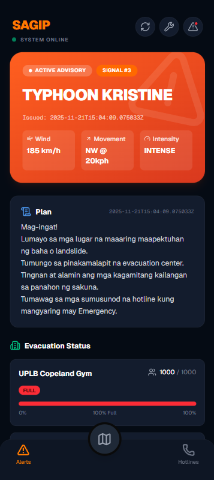

# PJDSC 2025


## Synchronizing Action through Geohazard Information Platform

A full-stack application for the PJDSC-25 project.

By harnessing data science and real-time geohazard maps, we synchronize rescuers, evacuees, and information onto one intuitive platform, building smarter, more resilient communities from the ground up

## Core Features
- Comprehensive historical hazard risk profile
- Interactive, geospatial risk visualization dashboard
- Essential data visualizations and summaries required for strategic decision-making
- Cross-platform plan dissemination across the barangay community

## Limitation
- Data and implementation coverage is limited to **Brgy. Batong Malake, Los Baños, Laguna**

## Tech-stack
- **Backend:** , , 
- **Frontend & Mobile PWA:** , , , 


### Created by **link.od**
* Alexander Gabriel A. Aranes
* Edgar Alan Emmanuel B. Tiamzon III
* Djeana Carel M. Briones
* Lara Franchesca N. Dy
* Vince Allen V. Tabelisma

## Screenshots



## Setup Instructions

### 1. Dataset & Static Data Preparation
Prepare the backend environment and process the dataset.

```bash
cd backend
python3 -m venv venv
source venv/bin/activate
pip install -r requirements.txt

# Run the converter script
python dataset/scripts/converter.py
```

Copy the processed data to the frontend.
```bash
# From the project root
mkdir -p frontend/public/processed_data
cp backend/dataset/processed_data/*.geojson frontend/public/processed_data/
```

### 2. Backend Setup
Start the API server.

```bash
cd backend
source venv/bin/activate
make run
```

### 3. Frontend Setup
Start the web dashboard.

```bash
cd frontend
npm install
npm run dev
```
Access at: `http://localhost:3000`

### 4. Mobile Setup
Start the mobile PWA.

```bash
cd mobile-frontend
npm install
npm run dev
```
Access at: `http://localhost:3001`

## License
This project is licensed under the MIT License. See the [LICENSE](LICENSE) file for details
